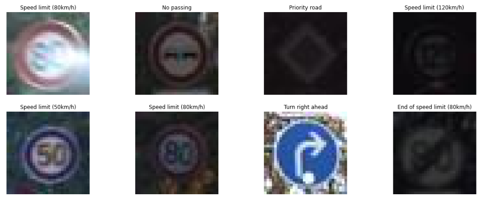
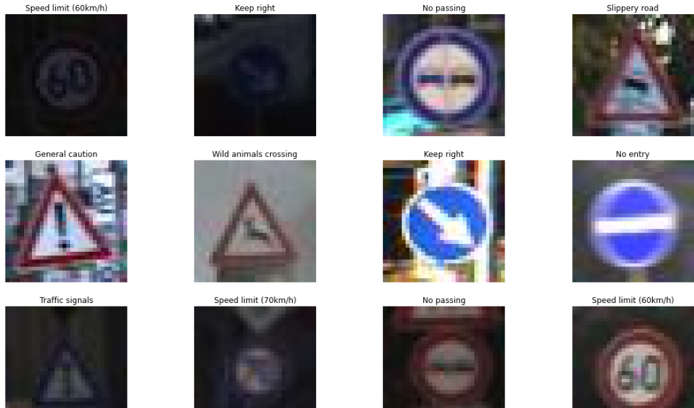

# Traffic_Sign_Recognition
<h3>It is a model to recognize traffic signs. It can recognize 43 different signs like Speed limit (20km/h), Speed limit (30km/h)
, Right-of-way at the next intersection, Pedestrians, Children crossing etc.</h3> 
<h4>I used ResNet50 pre-trained model to train this model. I also tried VGG16 pre-trained model but it's accuracy was not good.</h4>
<h5>Dataset is available at :- https://www.kaggle.com/flo2607/traffic-signs-classification</h5>

 <h3>VGG16 predictions :-</h3>

  

  

